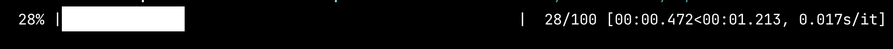

# TQDM-like progress bar for Node.js console applications

```
node-console-progress-bar-tqdm
```

This is a library that implements progress bar in console for Node.js in the style of
[tqdm](https://tqdm.github.io/) Python library.

This library implements very similar interface and options set.

Language support: TypeScript and JavaScript with CommonJS and EcmaScript modules.

Input data support: `Array`, `Number`, `Generator`, `AsyncGenerator`, `Iterable`, `Iterator`, `AsyncIterable`, `AsyncIterator`.
When `Number` is passed as an input, there will be iterations over a range from 0 to this number.

Tested on Linux, macOS and Windows.

## Table of contents

  * [How does it look?](#how-does-it-look)
  * [Quick reference](#quick-reference)
  * [Quick examples](#quick-examples)
  * [Installation](#installation)
  * [Examples](#examples)

## How does it look?

```
  50% |████████████████████████████████████████████████                                                 |  50/100 [00:01.630<00:01.630, 0.033s/it]
```

<video src="assets/progress-bar.mp4" width="100%" autoplay loop muted>
    
</video>

## Quick reference

This is a quick API reference. It's useful to look to some examples that are below.

```ts
// When using custom unit names, different forms of unir name could be passed.
export type TqdmUnitTable = Record<Intl.LDMLPluralRule, string>;
export type TqdmUnitOption = string | [string, string] | TqdmUnitTable;

export type TqdmOptions = {
    // Description, the prefix for the progress bar.
    description?: string;

    // The width of the entire output message.
    // By default, the output fills whole the line.
    maxColWidth?: number;

    // "Braces" around the progress bar.
    // Default: ["|", "|"].
    progressBraces?: [string, string];

    // Symbol for building the progress bar.
    // Default: "█".
    progressSymbol?: string;

    // Color of the progress bar in terminal format.
    // If it's not set will be color by default.
    // This value is corresponding to ANSI format: https://en.wikipedia.org/wiki/ANSI_escape_code#Colors
    // Examples:
    //   1. 4-bit (8) colors: "black", "red", …, "white".
    //   2. 8-bit (256) colors, prefix "$": "$16", "$17", …, "$255".
    //   3. 24-bit colors: "#ccc", "#00ff12" – CSS-like color literal.
    progressColor?: string;

    // Counter initial value.
    // Default: 0.
    initial?: number;

    // The number of expected iterations.
    // If not specified and `input` has `length`, `input.length` will be used.
    // If `input` is number, this number will be used.
    total?: number;

    // Step of the progress.
    // Default: 1.
    step?: number;

    // Value that will be used to define the unit of each iteration.
    // It can be a string: "thing", a tuple: ["one thing", "many things"]
    // or a table:
    // {
    //   "zero":  "0 things",
    //   "one":   "1 thing",
    //   "two":   "2 things",
    //   "few":   "few things",
    //   "many":  "many things",
    //   "other": "some things"
    // }
    // Default: "it".
    unit?: TqdmUnitOption;

    // If true, the number of iterations will be reduced/scaled
    // automatically and a metric prefix following the
    // International System of Units standard will be added
    // (kilo, mega, etc.).
    // Default: false.
    unitScale?: boolean;

    // Stream to write the progress bar.
    // Default: `process.stderr`.
    stream?: NodeJS.WritableStream,

    // Minimum progress display update interval in milliseconds.
    // Default: 50ms.
    minInterval?: number;

    // Force output like the stream is a terminal.
    // Try to emulate the terminal behavior.
    forceTerminal?: boolean;
};

// Input type of the library main method.
// It means that Array, Generator and AsyncGenerator can be used as well as these generic types.
export type TqdmInput = Iterable<unknown> |
    Iterator<unknown> |
    AsyncIterable<unknown> |
    AsyncIterator<unknown> |
    number;

// The main method that generated progress bar with an original data iterator.
export declare function tqdm<TInput extends TqdmInput>(input: TInput, opts?: TqdmOptions): Tqdm<TInput>;

// The main class thar implements the iterator over rhe original data and progress bar rendering.
export declare class Tqdm<TInput extends TqdmInput> implements Iterable<TqdmItem<TInput>>, AsyncIterable<TqdmItem<TInput>>, ITqdmSyncIteratorContainer<TqdmItem<TInput>>, ITqdmAsyncIteratorContainer<TqdmItem<TInput>> {
    constructor(input: TInput, options?: TqdmOptions);
    [Symbol.iterator](): TqdmSyncResultIteratorReturn<TInput>;
    [Symbol.asyncIterator](): TqdmAsyncResultIteratorReturn<TInput>;
    nextSync(): TqdmIteratorResultSync<TInput>;
    nextAsync(): TqdmIteratorResultAsync<TInput>;
}

// Progress bar class.
// Can be used when there is no need for iterator over originall data.
export declare class TqdmProgress implements ITqdmProgress {
    constructor(options: TqdmOptions);
    update(by?: number): void;
    render(force?: boolean): void;
    close(): void;
}
```

## Quick examples

```ts
import {tqdm, TqdmProgress} from 'node-console-progress-bar-tqdm';

// Array as Iterable with length
for (const item: number of tqdm([1, 2, 3, 4, 5])) {
    doSomeWorkOn(item);
}

// Number generates range
for (const idx: number of tqdm(100_000)) {
    doSomeWorkOn(idx);
}

// Generator as Iterable without length
const inp1: Generator<Item> = itemGenerator();
for (const item: Item of tqdm(inp1)) {
    doSomeWorkOn(item);
}

// AsyncGenerator as AsyncIterable
const inp2: AsyncGenerator<Item> = itemAsyncGenerator();
for await (const item: Item of tqdm(inp2, {total: 100})) {
    doSomeWorkOn(item);
}

// Progress bar without using in a loop directly
const pb = new TqdmProgress({
    total: items.length,
    progressColor: '#f1d3c4',
});
// render the empty progress bar
pb.render();
items.forEach((item) => {
    doSomeWorkOn(item);
    // update progress bar by 1 item
    progressBar.update();
});
// force render for printing delayed symbols and other finalization (not required)
pb.close();

// Progress bar without using in a loop but with suitable wrapper with automatic opening and closing
const res1 = TqdmProgress.withProgress((progressBar) => {
    return items.map((item) => {
        const res = doSomeWorkOn(item);
        // update progress bar by 1 item
        progressBar.update();
        return res;
    });
}, {total: items.length, progressColor: '$128'});
handleResult(res1);

// An async version of the previous case
const res2 = await TqdmProgress.withAsyncProgress(async (progressBar) => {
    const res: HandledItem[] = [];
    for await (const item of getAsyncItems()) {
        res.push(await doSomeWorkOn(item));
        // update progress bar by 1 item
        progressBar.update();
    }
    return res;
}, {total: estimateItemsCount(), progressColor: '$200'});
handleResult(res2);
```

## Installation

```shell
npm install --save node-console-progress-bar-tqdm
yarn add node-console-progress-bar-tqdm
pnpm install node-console-progress-bar-tqdm
```

## Examples

In these examples, besides the main goal, different input collections are illustrated
as well as different module types: TypeScript, EcmaScript modules, CommonJS modules.

You can run these examples from this repository:

```shell
cd example
npm ci
npm start
```

| File | Title | Description | Tags |
| ---- | ----- | ----------- | ---- |
| [basic.cjs](example/examples/basic.cjs) | Basic example | Iterate over an array without any options | `CJS`, `Array`, `defaults` |
| [generator.mjs](example/examples/generator.mjs) | Generator examples | A couple of examples where we iterate over generator | `ESM`, `Generator`, `with/without total` |
| [countdown.mjs](example/examples/countdown.mjs) | Countdown | Countdown, progress bar changes from full to empty | `ESM`, `Iterator`, `countdown` |
| [unit-scaling.cjs](example/examples/unit-scaling.cjs) | Unit scaling, range iteration | Example with iteration over number range defined by `total` with unit scaling (k,M,G,T) | `CJS`, `Number`, `units`, `unit scaling` |
| [custom-progress-bar.mts](example/examples/custom-progress-bar.mts) | Custom progress style | Fully customized progress bar written on TypeScript | `TS`, `Generator`, `units`, `color`, `styling`, `max width` |
| [sync-iterator-input.mts](example/examples/sync-iterator-input.mts) | Iteration over sync iterator | Example with Iterator and Iterable as input | `TS`, `Iterable`, `color`, `styling` |
| [async-iterator-input.mts](example/examples/async-iterator-input.mts) | Iteration over async iterator | Example with AsyncIterator and AsyncIterable as input | `TS`, `AsyncIterable`, `async`, `for/await`, `color`, `styling` |
| [progress-with-no-iteration.cjs](example/examples/progress-with-no-iteration.cjs) | Using progress bar directly | There is no iteration over tqdm iterator, direct TqdmProgress usage. Progress split to 2 parts | `CJS`, `TqdmProgress`, `no tqdm()`, `flush output`, `resuming`, `color` |
| [progress-with-no-iteration-ctx.mts](example/examples/progress-with-no-iteration-ctx.mts) | Using progress bar through context helpers | There is no tqdm function, using withProgress and withAsyncProgress helpers | `TS`, `TqdmProgress`, `withProgress`, `withAsyncProgress`, `no tqdm()`, `color`, `styling`, `emoji` |
| [direct-iteration.mts](example/examples/direct-iteration.mts) | Direct usage of Tqdm class | Very advanced example with direct Tqdm usage | `TS`, `Generator`, `AsyncGenerator`, `async`, `async/await`, `no loop`, `units`, `color`, `styling` |
